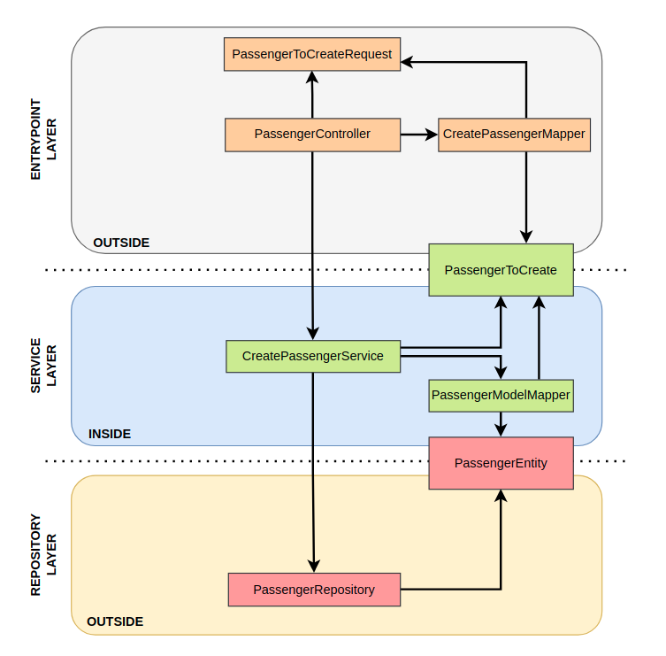

# Kotlin Spring REST API Sample
The project consists of creating, in the REST standard, an API sample to make travel requests with the resources that allow the following functionalities:

* CRUD (Create, Read, Update, Delete) for drivers
* CRUD (Create, Read, Update, Delete) for passengers
* Travel request creation
* Driver find available travel requests
* Driver accept travel request
* Driver refuse travel request

## About The Project
This is a test project to understand the work joining Kotlin and Spring.
The purpose of this API is to store driver and passenger data, making it possible to query available trips and providing endpoints to accept or reject a travel.
This project also proposes to practice test pyramid concepts and understand how important it is for the life cycle of a software project.

### Key Features
* Travel requests
* CRUD
* Kotlin
* Spring
* Tests (unit, integration, components/end-to-end)
* Containers

### Architecture Principles

The objective was to determine a simple architectural model, following the pattern: controller -> service -> repository.

The structure follows the following definition:


The controller accesses the service generating the domain objects, the service accesses the repository generating the entity objects.

Some good practices:
- No layer access Controller
- Service/models can only be accessed by Controller or another Service
- Repository/entities can only be accessed by Service

To make it easier, let's see a perspective of the feature of creating a passenger:



### API Documentation
The project is documented by springdoc-openapi-ui, so just access the following address:
```
http://localhost:8080/travels-api/swagger-ui
```

### Built With
* [IntelliJ IDEA](https://www.jetbrains.com/pt-br/idea/) - The IDE used
* [Java 8](https://www.java.com/pt-BR/) - Execution platform
* [Spring Boot - 2.6.2](https://spring.io/projects/spring-boot) - Spring Boot makes it easy to create stand-alone, production-grade Spring based Applications that you can "just run"
* [PostgreSQL](https://www.postgresql.org/) - The database used
* [Kotlin](https://kotlinlang.org/) - Language
* [JUnit](https://junit.org/junit5/) - Unit and integration tests
* [SpringMockK](https://github.com/Ninja-Squad/springmockk) - Support for Spring Boot integration tests written in Kotlin using MockK instead of Mockito
* [Docker](https://www.docker.com/) - Operating system-level virtualization.
* [H2 Database](https://www.h2database.com/html/main.html) - In memory database for integration tests
* [Mockito](https://site.mockito.org/) - Tasty mocking framework for unit tests
* [REST Assured](https://rest-assured.io/) - Testing and validating REST services
* [Spring Doc Open API](https://springdoc.org/) - Library helps to automate the generation of API documentation using spring boot projects

## Getting Started
To get a local copy up and running follow these simple steps.

### Prerequisites
This project requires Java 8 or higher and use an IDE of your choice that supports Maven.

### Installation
Clone the repo
```
git clone https://github.com/ezequieljuliano/kotlin-spring-rest-api-sample.git
```

## Usage
Open the project in your preferred IDE and run the main class **TravelsApplication** and use Postman to call the resources.

## Usage with Docker
Execute the command below in the terminal to generate the application's artifact and build the application's docker image:
```
mvn clean package dockerfile:build
```
Now execute:
```
docker-compose up
```

### Junit Tests
Run the unit tests and check that everything is fine.
Unit tests, integration tests and components/end-to-end tests were implemented.

## Contributing

Contributions are what make the open source community such an amazing place to be learn, inspire, and create. Any contributions you make are **greatly appreciated**.

1. Fork the Project
2. Create your Feature Branch (`git checkout -b feature/AmazingFeature`)
3. Commit your Changes (`git commit -m 'Add some AmazingFeature'`)
4. Push to the Branch (`git push origin feature/AmazingFeature`)
5. Open a Pull Request

## Contact

To contact us use the options:
* E-mail  : ezequieljuliano@gmail.com
* Twitter : [@ezequieljuliano](https://twitter.com/ezequieljuliano)
* Linkedin: [ezequiel-juliano-müller](https://www.linkedin.com/in/ezequiel-juliano-müller-43988a4a)